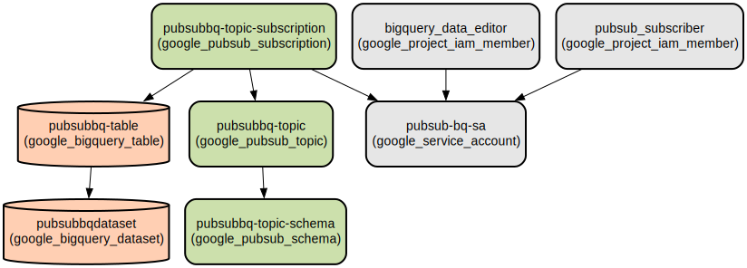

# Google Cloud Pub/Sub to BigQuery Data Integration Infrastructure

This Terraform project automates the setup of a data pipeline that streams messages from Google Cloud Pub/Sub directly into BigQuery tables. It provides a scalable, serverless architecture for real-time data ingestion and analytics.

The infrastructure creates a fully managed streaming pipeline with schema validation, automatic data loading, and proper IAM permissions. It supports structured data with a predefined schema (name and city fields) and handles the complete flow from message ingestion to data storage, making it ideal for real-time analytics and data warehousing use cases.

## Repository Structure
```
terraform/
├── main.tf                 # Main configuration file defining the core infrastructure
├── provider.tf            # Google Cloud provider configuration
├── variables.tf          # Global variable definitions
├── outputs.tf           # Output definitions
└── modules/
    ├── bigquery/       # BigQuery dataset and table configuration module
    │   ├── main.tf
    │   ├── outputs.tf
    │   └── variables.tf
    └── pubsub/         # Pub/Sub topic, schema, and subscription module
        ├── main.tf
        ├── outputs.tf
        └── variables.tf
```

## Usage Instructions
### Prerequisites
- Google Cloud Platform account with billing enabled
- Terraform v1.0.0 or later
- Google Cloud SDK installed and configured
- Required IAM permissions:
  - BigQuery Admin (`roles/bigquery.admin`)
  - Pub/Sub Admin (`roles/pubsub.admin`)
  - Service Account Admin (`roles/iam.serviceAccountAdmin`)

### Installation

1. Clone the repository and navigate to the terraform directory:
```bash
cd terraform
```

2. Initialize Terraform:
```bash
terraform init
```

3. Configure your GCP project:
Update `provider.tf` with your project ID:
```hcl
provider "google" {
  project = "your-project-id"
  region  = "us-central1"
}
```

4. Review and apply the configuration:
```bash
terraform plan
terraform apply
```

### Quick Start

1. After deployment, you can publish messages to the Pub/Sub topic using the following schema:
```json
{
  "name": "John Doe",
  "city": "New York"
}
```

2. The messages will automatically appear in the BigQuery table `pubsubbq-table` in the `pubsubbqdataset` dataset.

### More Detailed Examples

Publishing messages to the topic using gcloud:
```bash
gcloud pubsub topics publish pubsubbq-topic --message='{"name":"John Doe","city":"New York"}'
```

Querying data from BigQuery:
```sql
SELECT *
FROM `pubsubbqdataset.pubsubbq-table`
WHERE city = 'New York'
ORDER BY name;
```

### Troubleshooting

Common issues and solutions:

1. Schema Validation Errors
   - Error: "Message does not match schema"
   - Solution: Ensure your message follows the AVRO schema:
     ```json
     {
       "type": "record",
       "name": "Avro",
       "fields": [
         {"name": "name", "type": "string"},
         {"name": "city", "type": "string"}
       ]
     }
     ```

2. Permission Issues
   - Error: "Permission denied while setting up BigQuery subscription"
   - Solution: Verify the service account has the required IAM roles:
     ```bash
     gcloud projects get-iam-policy your-project-id \
       --flatten="bindings[].members" \
       --format='table(bindings.role)' \
       --filter="bindings.members:pubsub-bq-sa"
     ```

## Data Flow

The infrastructure enables real-time data streaming from Pub/Sub to BigQuery with schema validation. Messages published to the Pub/Sub topic are automatically loaded into BigQuery tables while maintaining data structure integrity.

```ascii
[Publisher] -> [Pub/Sub Topic] -> [Pub/Sub Subscription] -> [BigQuery Table]
     |              |                      |                       |
     |              |                      |                       |
     +-- JSON    --[Schema]----------------|                       |
     |              |                      |                       |
     +-- AVRO Format Validation ----------[Service Account]--------+
```

Component interactions:
1. Publishers send messages to the Pub/Sub topic in JSON format
2. Messages are validated against the AVRO schema
3. The Pub/Sub subscription uses the service account for authentication
4. Messages are automatically inserted into the BigQuery table
5. The BigQuery table schema matches the Pub/Sub schema definition

## Infrastructure



The following GCP resources are created:

### BigQuery
- Dataset: `pubsubbqdataset`
- Table: `pubsubbq-table` with schema fields:
  - name (STRING)
  - city (STRING)

### Pub/Sub
- Topic: `pubsubbq-topic`
- Schema: `pubsubbq-topic-schema` (AVRO format)
- Subscription: `pubsubbq-topic-subscription` with BigQuery integration

### IAM
- Service Account: `pubsub-bq-sa`
- IAM Roles:
  - BigQuery Admin
  - Pub/Sub Admin